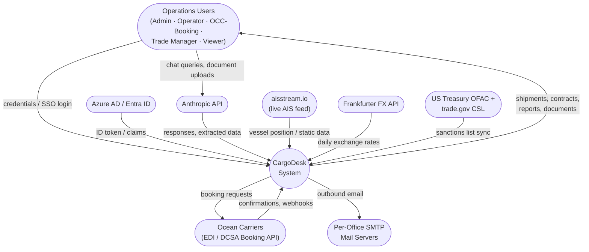
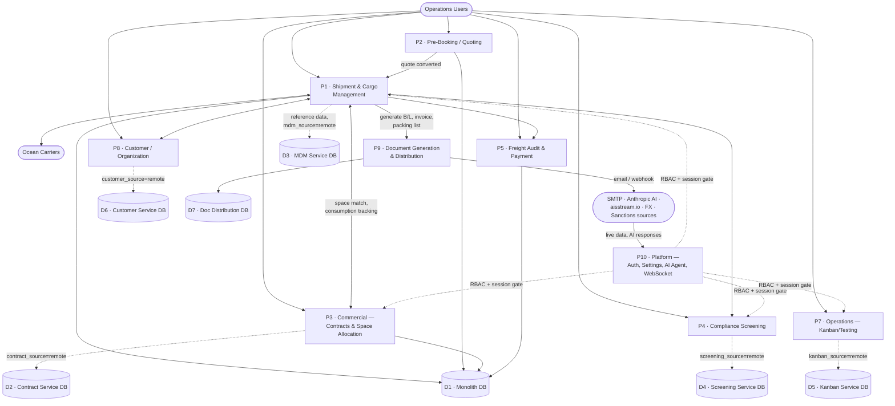

# CargoDesk — Design & Functional Specification (DFS)

**Status**: first pass, top-down. **Scope**: whole application, at the level of its major
functional domains and system-to-system data flows — not an exhaustive per-route specification.
**Companion documents**: [`ARCHITECTURE.md`](ARCHITECTURE.md) (technical architecture, module
maps, per-subsystem implementation detail — the authoritative reference for *how* something is
built), [`CLAUDE.md`](CLAUDE.md) (contributor-facing patterns and conventions). This document
answers a different question than either: *what does the system do, for whom, and how does data
move through it* — the classic Design & Functional Specification pair of concerns, DFDs included.

An offline, self-contained HTML copy (same content, diagrams baked in as static SVG — no network
dependency at all) lives at [`documentation/cargodesk-dfs.html`](documentation/cargodesk-dfs.html)
— open it directly in a browser. The live, interactive artifact version (same content) is linked
from `documentation/README.md`.

---

## Table of Contents

1. [Purpose & Audience](#1-purpose--audience)
2. [System Overview](#2-system-overview)
3. [Actors & Roles](#3-actors--roles)
4. [Data Flow Diagrams](#4-data-flow-diagrams)
   - 4.1 [Level 0 — System Context](#41-level-0--system-context)
   - 4.2 [Level 1 — Major Process Decomposition](#42-level-1--major-process-decomposition)
5. [Functional Specification by Domain](#5-functional-specification-by-domain)
6. [Design Specification Summary](#6-design-specification-summary)
7. [Data Stores](#7-data-stores)
8. [Glossary](#8-glossary)

---

## 1. Purpose & Audience

This document specifies CargoDesk's functional scope and data flow, domain by domain, for anyone
who needs to reason about the system without reading its source: onboarding, a design review
before a major change, or an external audit. It is deliberately **top-down** — the first pass
covers every major domain at a consistent level of detail, rather than one domain in exhaustive
depth. Where a domain needs deeper treatment later, that becomes its own Level 2 DFD and
functional appendix, added incrementally.

## 2. System Overview

CargoDesk is a single-tenant freight-forwarding operations system covering the full commercial
lifecycle of a sea-freight shipment: quoting, booking, container/cargo management, operational
accounting, space allocation against carrier contracts, multi-list compliance screening, customs
filing, and an AI assistant over all of it. It runs as one Express monolith plus seven extracted
microservices (§6), each independently toggleable between "local" (monolith-owned data) and
"remote" (its own service) per domain — a deliberate, incremental extraction strategy rather than
a single big-bang rewrite.

## 3. Actors & Roles

| Role | Typical user | Scope |
|---|---|---|
| **admin** | System administrator | Full access, including user management, app settings, secrets |
| **operator** | Day-to-day operations staff | Full shipment/contract/booking read-write, no admin config |
| **occ_bk** | Operations/booking desk | Shipment and booking read-write, narrower than operator on admin-adjacent actions |
| **trade_manager** | Trade-lane owner | Read-write scoped to their trade lane/office; owns credit-hold override authority |
| **sales** (v0.91.1) | Quoting/pipeline owner | Read-write on Quotes and Opportunities only; deliberately no booking authority (not granted on shipment/booking/EDI/customs-filing writes) |
| **viewer** | Read-only stakeholder | Read access only, scope-limited the same way as other roles |

A user can hold more than one role; `occ_bk`/`trade_manager`/`sales` are co-equal, non-hierarchical
specialty grants (same rank), not rungs on the admin/operator/viewer ladder. Access is further
scoped by office and/or trade lane (`allOffices`/`userOffices`, `scopeItems`) independent of role —
two `operator`s can see disjoint sets of shipments. Since v0.91.1, office scoping also supports a
**Branch or Country grant** — a single admin action that cascades to every office under it
(inheriting new offices added later), with an optional narrower exclusion carved back out —
instead of only ever assigning one office at a time; this same office-scoping mechanism now also
governs Quotes/Opportunities visibility, which had none before. See `USER-MANAGEMENT-REDESIGN.md`
for the full model and ARCHITECTURE.md §8.9 for the underlying mechanics (JWT, idle-timeout, SSO).

## 4. Data Flow Diagrams

### 4.1 Level 0 — System Context

The whole system as one process, with every genuinely external actor and system around it.

**Reading this diagram**: a circle is a process (here, the whole system as one box); a rounded
rectangle is an external entity — something CargoDesk exchanges data with but does not control.
Every arrow is a real, code-traceable data flow (§6 names the exact call sites); none are
aspirational.

### 4.2 Level 1 — Major Process Decomposition

The system broken into its major functional processes and the data stores behind them. Dashed
arrows mark a **toggle boundary** — five of these processes can run against either the monolith's
own local tables or a standalone microservice, per an `app_settings` flag, with no other code path
change (ARCHITECTURE.md §8.1).

**Reading this diagram**: a rectangle is a process; a cylinder is a data store. `P1`–`P5`, `P7`,
`P8`, `P10` are logical processes hosted in the monolith today; five of them (`P3`, `P4`, `P7`,
`P8`, and the MDM lookups every process makes) can be re-pointed at a standalone service and its
own database (`D2`–`D6`) without any other process's code changing — the dashed lines are exactly
that seam. `P9` (document generation) is always split across two real, always-on services
(PDF Render + Document Distribution) regardless of any toggle.

## 5. Functional Specification by Domain

Each domain below: **Purpose**, **Key Functions**, **Roles**, **Primary Data**, and one or two
**Business Rules** worth knowing before touching it. Deep implementation detail lives in
ARCHITECTURE.md §8 (cross-referenced per domain).

### 5.1 Pre-Booking / Quoting & Pipeline (P2)
**Purpose**: capture and price freight demand before a real shipment exists — a two-stage funnel,
an `opportunity` (lead-tracking, pre-pricing) that converts into a `quote` (priced, customer-facing).
**Key functions**: track a lead through New → Qualified → Converted (to Quote)/Lost; create a quote
against a matched contract or spot rate; Draft → Sent → Accepted/Declined/Expired lifecycle;
convert an accepted quote into a real shipment, carrying parties, containers, and cost lines across.
The quote and opportunity lists are filterable the way the Shipments list is: an Excel-style checklist
on each column header, free-text search, sort, and server-side paging (the shared table system,
ARCHITECTURE.md §8.23 — Quotes is its pilot; other lists follow).
**Roles**: operator, occ_bk, sales, admin (write); all roles (read, scope-permitting). `sales`
(v0.91.1) is this domain's dedicated role — owns both objects, no booking authority elsewhere.
**Primary data**: `opportunities`, `quotes`, `quote_lines`.
**Business rules**: an expired quote cannot be accepted; conversion splits BUY (from the matched
contract) and SELL (from the quote's own price) cost lines — they are independent figures, not
derived from each other. Since v0.91.1 both objects carry an `office_id` and are office-scoped the
same way shipments are (previously neither had any access scoping at all) — the office and any
trade-lane restriction on the acting user's scope both apply. See ARCHITECTURE.md §8.2 and
`USER-MANAGEMENT-REDESIGN.md`.

### 5.2 Shipment & Cargo Management (P1)
**Purpose**: the operational core — everything about moving one shipment from booking to delivery.
**Key functions**: shipment CRUD; multimodal route legs and routing-term derivation; container/
cargo manifest with DG classification; parties (shipper/consignee/principal + flexible additional
roles); milestones; carrier booking lifecycle (EDI); shipment messaging; audit history.
**Roles**: operator, occ_bk (write, scoped by office/trade lane); trade_manager (write within their
lane); viewer (read only).
**Primary data**: `shipments`, `shipment_legs`, `containers`, `shipment_parties`,
`shipment_milestones`, `carrier_bookings`, `shipment_messages`, `shipment_events`.
**Business rules**: a shipment's space badge (Confirmed/Warning/Exceeded) is recomputed on every
container, booking, or allocation-link change — never a stale, on-demand-only calculation.
Cancelling a shipment cascades to cancel its carrier booking. See ARCHITECTURE.md §8.6, §8.10,
§8.12.

### 5.3 Commercial — Contracts & Space Allocation (P3 / P3a)
**Purpose**: the commercial terms a shipment books against, and the physical capacity a carrier has
actually committed.
**Key functions**: contract CRUD (legs, rates, routings, container-type/IMDG filters); contract
matching by route/date/routing-term; space configuration (TEU allocation per carrier/route/period)
with conflict detection; real-time Confirmed/Pending/Rejected consumption tracking against each
allocation. The contracts list is filterable the way the Shipments list is — a checklist on every
column header, free-text search, sort, an "active as of" date, and server-side paging (the shared
table system, ARCHITECTURE.md §8.23). Schedule Search finds contracts for a lane (POL/POD, as-of date,
carrier, account, routing term) and lets the user request sailings on any result; its results can be
narrowed by column and sorted (including cheapest-first once a container mix is chosen), in the browser.
**Roles**: admin, operator, trade_manager (write); all roles (read).
**Primary data**: `contracts`* , `contract_legs`* , `contract_rates`* , `allocations`.
*(owned by the Contract Management Service when `contract_source=remote`, monolith-local
otherwise.)*
**Business rules**: only a *Confirmed* booking counts as real consumption against an allocation's
capacity — Pending and Rejected are shown but never subtracted. This single rule is the
authoritative definition every consumption view in the app (Dashboard, Space Configurations page,
per-shipment badge) must agree with; disagreement between views has been a recurring, actively
hunted bug class in this codebase. See ARCHITECTURE.md §8.6.

### 5.4 Compliance Screening (P4 / P4a)
**Purpose**: screen every shipment party and customer against denied-party lists before/while a
shipment proceeds.
**Key functions**: 12-list sanctions screening (OFAC SDN + Consolidated Screening List) across
every party role on a shipment; auto-re-screen on any party change; a company-wide compliance
roll-up view; customs filing (simulated AES/EEI, ISF/AMS).
**Roles**: operator, occ_bk (act on hits); admin (manage screening config); all roles (read status).
**Primary data**: `shipment_screenings`, `sanctions_entries`* , `customs_filings`.
*(owned by the Screening Service when `screening_source=remote`.)*
**Business rules**: a screening hit blocks nothing automatically — it surfaces for manual officer
review and override, logged. See ARCHITECTURE.md §8.4.

### 5.5 Freight Audit & Payment (P5)
**Purpose**: reconcile what a carrier actually invoices against what was contracted and accrued.
**Key functions**: carrier invoice import/matching against contract rates and accrued cost lines;
Detention & Demurrage pre-audit; a reconciliation modal (Overwrite All / Ignore & Add Missing /
Discard) when a rate refresh would otherwise silently clobber a manual correction. Both the invoice list
and the open-exceptions queue are filterable the way the Shipments list is — header checklists, search,
sort, paging (the shared table system, ARCHITECTURE.md §8.23).
**Roles**: operator, admin, trade_manager (with `canViewFinance`).
**Primary data**: `shipment_cost_lines`, `carrier_invoices`.
**Business rules**: a cost line's `source` (contract/manual/automated) must survive a rate refresh
correctly, or a dispatcher's manual correction gets silently destroyed by the next "Update Carrier
Costs" run — a real, previously-shipped bug. See ARCHITECTURE.md §8.3.

### 5.6 Master Data Management (P6a)
**Purpose**: the shared reference data every other domain depends on.
**Key functions**: carriers, vessels, ports (14,269 UN/LOCODEs) with linked-port equivalence, trade
lanes, countries, commodities, charge codes, pack types, carrier line agents (per-port/country
representative resolution), carrier service **loop codes** with a directional (Eastbound/Westbound)
port rotation, and an **HS Codes** registry of real 6-digit Harmonized System codes that cargo
forms pick from instead of typing free text.
**Roles**: admin (write; HS Codes writes also allow operator); every domain (read, as a dependency,
not a direct user-facing action).
**Primary data**: owned by the MDM Service when `mdm_source=remote`, monolith-local otherwise.
Loop Codes (`loop_codes`, `loop_code_ports`) and HS Codes (`hs_codes`) are always monolith-local —
they are not part of the MDM Service's data set.
**Business rules**: port-lane and port-country lookups are hot-path, read on every shipment mapped
— they stay as in-process caches regardless of which mode is active, never a live per-request
fetch. See ARCHITECTURE.md §8.1. A loop's rotation is two independent lists (each stop tagged
Eastbound or Westbound, a port allowed in both) that a shipment header's Loop field resolves and
draws. The HS Codes page can look a classification up live from the EU's public tariff service, but
that result is shown and copied by hand, never stored — the service's terms forbid caching it.
See ARCHITECTURE.md §8.24.

### 5.7 Operations — Kanban / Testing (P7 / P7a)
**Purpose**: internal engineering/ops ticket tracking and manual test-case management, linked to
shipments where relevant.
**Key functions**: a 6-column Kanban board with Epic→Story→sub-task nesting; a separate test-case
repository with test runs; an automated ops-sweep that opens real tickets for detected operational
gaps (e.g. a stale booking).
**Roles**: admin, operator (write); all roles (read).
**Primary data**: owned by the Kanban/Testing Service when `kanban_source=remote`.

### 5.8 Customer / Organization Management (P8 / P8a)
**Purpose**: the counterparties CargoDesk transacts with, and their internal grouping.
**Key functions**: customer CRUD with identifiers/contacts; credit control (AR aging, exposure,
hold/override authority scoped to the trade lane's own trade manager); customer hierarchy
(parent/subsidiary rollup); derived roles (shipper/consignee/etc. computed from actual usage, not
hand-maintained checkboxes). The customer list is filterable the way the Shipments list is — checklists
on company, role and city/country, free-text search, sort, server-side paging — with an All / Trading
Customers / Service Providers switch on top (the shared table system, ARCHITECTURE.md §8.23). A Credit
Overrides queue lists every shipment currently blocked by a credit hold or an over-limit customer, with
the same filtering, search and sort applied in the browser; only the shipment's own lane trade manager
can release or approve.
**Roles**: operator, admin (write); trade_manager (credit override, within their lane).
**Primary data**: owned by the Customer/Organization Service when `customer_source=remote`.
**Business rules**: credit-hold/over-limit override authority belongs exclusively to the
shipment's own lane trade manager — not a blanket admin power. See ARCHITECTURE.md §8.1.

### 5.9 Document Generation & Distribution (P9 / P9a / P9b)
**Purpose**: produce and deliver every generated document (B/L, invoices, packing lists, and more)
as a real, tamper-evident signed PDF.
**Key functions**: server-side rendering (headless Chromium) with CAdES/PKCS#7 signing; a
per-office/carrier free-form Document Template Editor (BL01 pilot); outbound delivery via email or
webhook with its own retry/failure handling, decoupled from the request/response cycle that
triggered generation.
**Roles**: operator, occ_bk (generate/send); all roles (view/download, scope-permitting).
**Primary data**: `shipment_documents`; delivery state owned by the Document Distribution Service.
**Business rules**: PDF Render is stateless by design — no document content is ever persisted
there, only rendered and handed off. See ARCHITECTURE.md §8.1, §12.

### 5.10 Platform (P10)
**Purpose**: the cross-cutting concerns every other domain relies on.
**Key functions**: authentication (JWT + optional Azure AD/Entra SSO) and 5-role RBAC; app-wide
feature toggles; system messages; live FX rates; per-shipment WebSocket subscriptions (not blanket
broadcast); the AI Agent (tool-calling chat + document extraction); GP-by-trade-area reporting.
**Roles**: admin (settings, secrets, user management); all roles (auth, as a precondition for
everything else).
**Primary data**: `users`, `app_settings`, `system_messages`.
**Business rules**: a secret setting (SSO client secret, AI API key, AIS key) is never returned in
plaintext to any role via the generic settings read — a real, previously-shipped vulnerability
class, now closed with a masked-boolean pattern. See ARCHITECTURE.md §8.8, §8.9, §8.13.

## 6. Design Specification Summary

- **Stack**: React 18 + Vite frontend; Express + Node backend; Postgres (via `pg`, or embedded
  `@electric-sql/pglite` with no `DATABASE_URL`) for every service's own data.
- **Topology**: one monolith (port 3001) + seven independently deployable services — Document
  Distribution (3002), PDF Render (3003), Contract Management (3004), MDM (3005), Screening
  (3006), Kanban/Testing (3007), Customer/Organization (3008).
- **Extraction pattern**: five of the seven follow one repeatable shape — a per-domain
  `app_settings` toggle (`*_source: 'local' | 'remote'`), a CLI migration script to move existing
  data across, and zero code duplication at call sites (a single `getSettings()` branch, not two
  parallel implementations). The other two (PDF Render, Document Distribution) were extracted for
  operational reasons (retry isolation, a heavy bursty operation) and have no local/remote toggle
  — they are always-on, dedicated services.
- **Real-time**: per-shipment WebSocket subscriptions push message/badge/status updates to open
  clients; nothing polls on a fixed interval for data that has a real push path.
- **Security**: JWT (8-hour token) + optional SSO; 5-role RBAC scoped further by office/trade lane;
  secrets are write-only through the API (masked booleans on read).
- **Visual design**: the Dashboard, Command Center and Shipment Details use the "Trade Horizon"
  glass-card design language, which follows the app's dark/light toggle (a dual-theme token set
  swapped in place, ARCHITECTURE.md §4). Other pages use the classic theme. Lists that adopt the
  shared table system (§8.23) behave identically to the Shipments list.
- **Quality gates**: a backend test chain (`npm test`), a frontend Vitest suite and a Cypress suite
  all run in CI against a database that starts empty — every test provisions the reference data it
  needs (e.g. offices) rather than assuming a developer's long-lived local data (ARCHITECTURE.md §10).

Full technical detail (module maps, request lifecycle, ID formats, the complete data model) is in
ARCHITECTURE.md §§2–7 and is intentionally not duplicated here.

## 7. Data Stores

| ID | Store | Owner | Representative tables |
|---|---|---|---|
| D1 | Monolith DB | `server.js` + `routes/*.js` | `shipments`, `containers`, `shipment_cost_lines`, `shipment_parties`, `shipment_milestones`, `carrier_bookings`, `quotes`, `allocations`, `users`, `app_settings` |
| D2 | Contract Service DB | `services/contract-management/` | `contracts`, `contract_legs`, `contract_rates`, `contract_routings` |
| D3 | MDM Service DB | `services/mdm/` | `carriers`, `vessels`, `port_locations`, `linked_ports`, `trade_lanes`, `countries`, `commodities`, `carrier_agents` |
| D4 | Screening Service DB | `services/screening/` | `sanctions_entries`, `sanctions_syncs` |
| D5 | Kanban Service DB | `services/kanban/` | `tickets`, `ticket_links`, `test_items`, `kb_projects` |
| D6 | Customer Service DB | `services/customers/` | `customers`, `customer_identifiers`, `customer_contacts`, `customer_screenings` |
| D7 | Doc Distribution DB | `services/document-distribution/` | webhook configs, delivery attempts |

PDF Render (P9a) is stateless and owns no data store.

D1 also holds three master-data registries that are deliberately *not* mirrored into D3: `loop_codes`
and `loop_code_ports` (carrier service loops and their directional rotations) and `hs_codes`
(curated HS-6 classification codes).

## 8. Glossary

| Term | Meaning |
|---|---|
| **DFD** | Data Flow Diagram — the notation used in §4: processes (circles), external entities (rectangles), data stores (cylinders), labeled flows (arrows). |
| **TEU** | Twenty-foot Equivalent Unit — the standard unit for container/space capacity (20ft = 1 TEU, 40ft = 2 TEU, admin-overridable per container type). |
| **EDI** | Electronic Data Interchange — the carrier booking request/response protocol; DCSA is the specific industry-standard EDI schema this app targets for real carrier integrations. |
| **SDN / CSL** | Specially Designated Nationals (OFAC) / Consolidated Screening List (trade.gov) — the two primary US sanctions/denied-party data sources this app screens against. |
| **B/L** | Bill of Lading — the core transport document; House B/L and Master B/L are both modeled. |
| **INCOTERM** | International Commercial Terms — defines which party bears cost/risk at each point in the shipment's journey. |
| **AIS** | Automatic Identification System — the maritime vessel-tracking protocol this app consumes live via aisstream.io. |
| **RBAC** | Role-Based Access Control — this app's 5-role permission model (§3). |
| **HS Code** | Harmonized System code — the international goods-classification number; the first 6 digits are common worldwide (chapter = the first 2). CargoDesk's registry holds real 6-digit codes; national extensions (e.g. the EU's 8-digit CN) are looked up live, never stored. |
| **Loop code** | A carrier's named recurring service rotation (e.g. `AL1`) — the ordered list of ports one vessel string calls at, out and back. |
| **Eastbound / Westbound (EB / WB)** | The two directional legs of a loop. By convention transatlantic Europe→US is Westbound and transpacific Asia→US is Eastbound; each stop in a loop's rotation carries one of the two. |
