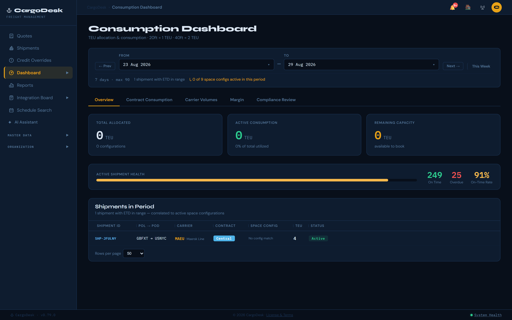
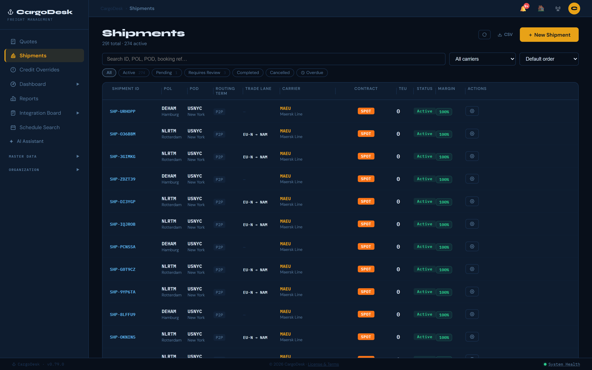
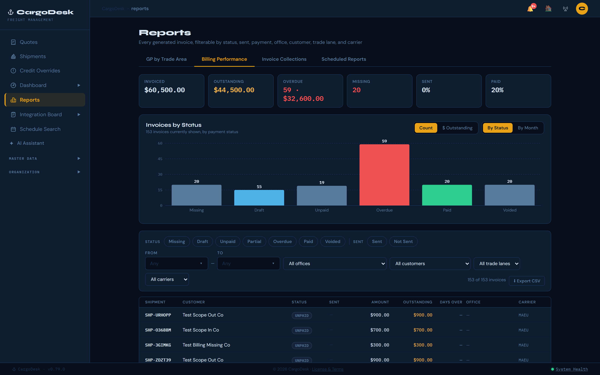
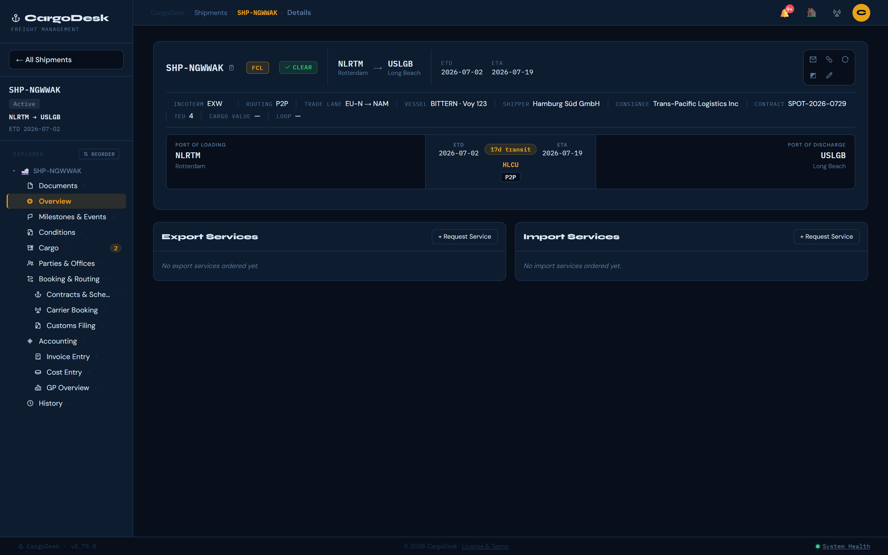
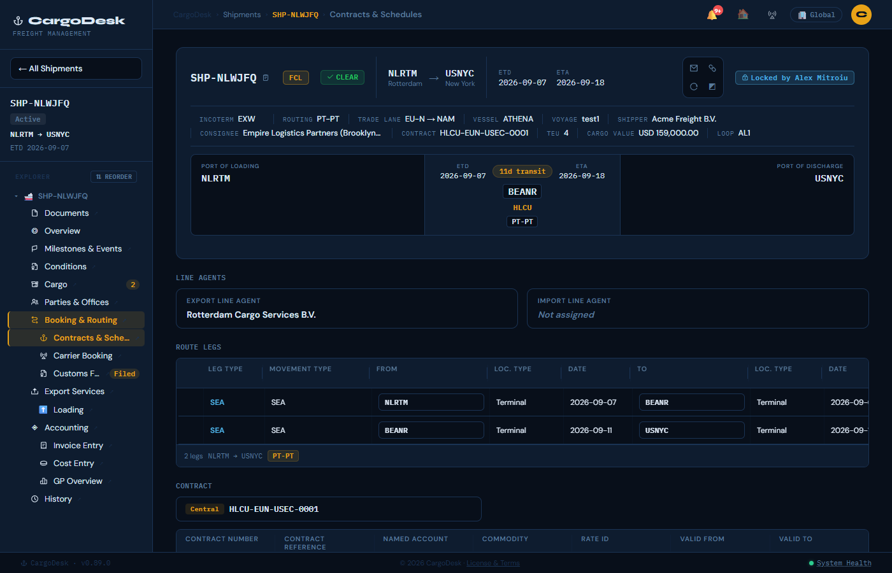

# ⚓ CargoDesk

> Freight management application for tracking ocean shipments, carrier space utilisation, contracts, and maritime master data.

[](https://github.com/alex-mitroiu/CargoDesk/actions/workflows/ci.yml)
[](.)


Free for personal and internal non-commercial use. Commercial use — including
offering it as a service or reselling it — requires a separate written
license from the copyright holder. See [LICENSE](LICENSE) and the in-app
End-User License Agreement for full terms.

---

## Screenshots

| | |
|---|---|
|  **Consumption Dashboard** — TEU allocation, active shipment health, and shipments in period |  **Shipments** — server-side filter, sort, and pagination across the fleet |
|  **Billing Performance** — invoice status breakdown, filterable by office/customer/trade lane/carrier |  **Shipment Detail** — route, vessel, and party summary with a persistent header bar |
|  **Contracts & Schedules** — route legs, carrier line agents, and the linked contract for a shipment | |

---

## Features

### Shipments & Cargo
- **Shipment lifecycle tracking** — container-level cargo detail (commodity, weight, volume, IMDG DG class), Shipper/Consignee/Principal parties, and a Requires Review status stage.
- **Persistent shipment header** — ID, route, dates, vessel, contract, TEU, and a Door→POL→POD→Terminal journey bar visible across every sub-page, correct even for Door pickups and multi-leg transshipment routings.
- **Multimodal route legs** — a 14-column leg table (Pick-up/SEA/Feeder/Rail/Air/Delivery) with auto-derived carrier fields and a routing-term engine (e.g. `DR-CY`) computed from the carrier-covered legs.
- **Full audit trail** — every field change, status transition, and container edit logged as a colour-coded timeline on the shipment history page.
- **Threaded messages** — a real-time (WebSocket, polling fallback) per-shipment message panel with unread badges and role/timestamp display.
- **Quick container setup** — configure count, equipment type (visual TEU picker), weight, volume, and DG flag directly on the New Shipment form.
- **Declared value** — customs/insurance value with a 10-currency select, surfaced on every relevant generated document.
- **New-tab workflow** — open a shipment in its own tab with an unsaved-changes guard before closing.

### Scheduling & Booking
- **Sailing search & booking** — search live or demo sailings by a 2/4/8/12-week window and attach one to a shipment's schedule with one click.
- **Schedule History** — a read-only audit trail of every sailing added or removed, including transshipment (TSP) multi-leg detail.
- **Sailing management safeguards** — the active sailing is highlighted in the picker, replacing one requires confirmation, and inconsistent ETD/ETA surfaces a warning badge.
- **Editable Route Legs on the Schedules page** — legs auto-order Pick-up-first/Delivery-last; "Add Sailing" updates every affected leg on a multi-leg pick, not just the first.
- **Dedicated Services** — an Export/Import services dashboard (VGM, Haulage, Fumigation, Storage, Customs Clearance, and more), each with a vendor, office, and a fully audit-logged status lifecycle.

### Contracts & Space Allocation
- **Carrier contracts** — rate contracts with route legs, POL/POD location type, validity, and IMDG class filters, MDM-managed.
- **Contract matching** — resolves eligible contracts from a shipment's route/dates/routing term, with inclusive carrier-haulage logic.
- **Space configurations** — TEU allocation per carrier/route with conflict detection, utilisation sparklines, and an alert-threshold badge, plus a renewal archive for expired configs.
- **Linked Shipments & consumption tracking** — see every shipment consuming a config's space (contract-aware, resolves linked-port equivalents), and a Dashboard view of Allocated vs. Consumed TEU per contract.
- **Requires Attention** — a landing-page section surfacing over-threshold allocations and shipments needing review, worst-first.

### Accounting & Reporting
- **Operational accounting** — per-shipment BUY/SELL cost lines with charge codes, multi-currency FX, per-container assignment, and a full change-history modal.
- **Margin & GP reporting** — Buy/Sell/Gross Profit/Margin KPIs with a 6-week trend and carrier/trade-lane breakdowns, computed server-side in USD.
- **Billing Performance report** — every invoice, enriched and filterable by status/office/customer/lane/carrier.
- **CSV & XLSX export** — a one-click shipments CSV, plus a 4-sheet Excel dashboard workbook (programmatic or chart-enabled template-based).

### Compliance & Documents
- **Denied-party screening** — sanctions screening across every party role on a shipment, with a roll-up compliance status view.
- **Document Readiness Overview** — a coverage bar showing confirmed/draft/missing status across every required document type.
- **Signed PDF generation** — every generated document (B/L, invoices, packing lists, and more) is a real, tamper-evident signed PDF.
- **Freight Audit & Payment** — reconcile carrier invoices against contracted rates and accrued costs, with a Detention & Demurrage pre-audit.

### Master Data
- **Carriers, vessels & ports** — a 349-vessel IMO registry and a 14,269-record UN/LOCODE port directory with linked-port relationships and trade-lane assignment.
- **Customers** — full CRUD with address/contact detail, searchable typeahead used across every party-picker in the app.
- **Loop Codes** — a carrier service-loop registry with a rotation-timeline viewer, linkable from any shipment's derived loop code.

### Collaboration & Operations
- **Integration Board** — a 6-column Kanban (Ready→Released) with drag-to-reorder, Epic→Story→sub-task nesting, and per-shipment ticket linking.
- **Command Center** — a full-screen operational dashboard with live KPIs, an exception queue, a carrier on-time scorecard, and a transit-time trend chart.
- **Entity audit log & notifications** — a generic CREATED/UPDATED/DELETED history for master-data records, plus a notification bell combining threshold alerts and system messages.
- **AI Agent chat** — a tool-calling assistant that can look up shipments, contracts, and allocations on request.

### Platform
- **Authentication & RBAC** — JWT login with three roles (admin/operator/viewer), whole-shipment edit-locking, and an admin role-switcher for testing lower-privilege views.
- **Security hardening** — per-IP login rate limiting, a configurable password-expiry policy, and optional Azure AD/Entra SSO.
- **Landing page** — fleet KPIs, a weather widget, and a live FX currency converter.
- **Light/dark theme, resizable columns, and a built-in User Manual** covering Incoterms 2020 and IMDG dangerous goods classes.
- **System Health** — a one-click check across every internal route and external service dependency.

---

## Tech Stack

| Layer      | Technology |
|------------|-----------|
| Frontend   | React 18, Vite, custom design system (inline styles via design tokens) |
| Backend    | Node.js 22.5+, Express |
| Database   | SQLite via `node:sqlite` (built-in, no ORM) |
| Real-time  | WebSocket via `ws` package (shared HTTP server, `/ws` path) |
| Charts     | Recharts |
| Diagrams   | Mermaid (Kanban Epic diagram view) |
| PDF Export | jsPDF + jsPDF-AutoTable (document builders) |
| XLSX Export | ExcelJS (server-side workbook generation + template population) |
| Auth       | JSON Web Tokens (`jsonwebtoken`), `bcryptjs` password hashing |
| FX Rates   | Frankfurter / ECB API (free, no key required) |
| Weather    | Open-Meteo API (free, no key required) |

---

## Getting Started

### Prerequisites

- **Node.js 22.5 or later.** The database itself is Postgres-compatible — a real `postgres://`
  connection via `DATABASE_URL` in production, or an embedded `@electric-sql/pglite` instance
  with zero setup for local dev when `DATABASE_URL` is unset.

  Check your version: `node --version`

  If you use [nvm](https://github.com/nvm-sh/nvm) or [fnm](https://github.com/Schniz/fnm), the `.nvmrc` at the project root pins Node 22 — run `nvm use` or `fnm use` before installing.

### Install

```bash
git clone https://github.com/alex-mitroiu/CargoDesk.git
cd CargoDesk
npm install
```

### First-Time Setup

```bash
npm run setup
```

This does the one-time dance in the right order so you don't have to: boots the server once to
create its schema and a default admin account, shuts it down cleanly, then loads MDM reference
data (ports, carriers, vessels, commodities, regions, trade lanes). That order matters — see
[Troubleshooting](#troubleshooting) below for why running the seed step *while the server is
still up* corrupts the database — `npm run setup` and `npm run seed` both refuse to do that.

Optionally, `npm run seed:sample-data` also loads a committed snapshot of realistic demo business
data (shipments, customers, contracts, tickets) instead of starting from an empty shell. Neither
step carries any real user accounts — those are yours to create.

### Run

```bash
# Start the API + WebSocket server (port 3001) and Vite dev server (port 5173) together
npm run dev
```

Open [http://localhost:5173](http://localhost:5173)

### Stopping the Server

> ⚠️ **Don't force-kill the server** — Task Manager, `taskkill /F`, or closing a detached
> terminal can end the process before it closes its database connection, risking a corrupted
> database that then needs manual recovery.

`npm run dev` runs the API server, Vite, and every microservice as child processes under
`concurrently`. Whether a plain Ctrl+C in that terminal cleanly reaches all of them (especially
on Windows, where cross-process signal delivery is unreliable — a `taskkill` or a scripted
`process.kill` against the API server commonly force-terminates it outright rather than letting
its shutdown handler run) isn't guaranteed. The reliable way to stop the API server cleanly,
regardless of how it was started, is its dev-only graceful-shutdown route — it closes the HTTP
server and the database connection before exiting, then the process exits on its own:

```bash
# macOS / Linux
curl -X POST http://localhost:3001/internal/dev/shutdown
```

```powershell
# Windows PowerShell
Invoke-WebRequest -Uri http://localhost:3001/internal/dev/shutdown -Method POST
```

It only answers on `localhost`, and only outside `NODE_ENV=production`. Use it before closing a
terminal window, restarting after a code change, or killing a stuck port (see Troubleshooting
below) — it's the same clean shutdown a signal handler runs, just reachable over HTTP so it
works even for a detached or background process.

Want to re-import master data from scratch instead (e.g. after editing `data/*.csv`)? **Stop the
server first** (see above) — `npm run seed` writes to the database directly, and with the
embedded pglite database (no `DATABASE_URL` set), running it while the server is still up will
silently corrupt it; the corruption only shows up the next time the server restarts. The script
refuses to run if it detects the server still listening on :3001, but stop it properly regardless
of that guard, then restart once seeding finishes:

```bash
npm run seed             # re-imports ports, carriers, vessels, regions, commodities
```

Adding sample carrier contracts to poke around with is the opposite — `npm run seed:contracts`
talks to the live API over HTTP, so it needs the server **running**, not stopped:

```bash
npm run seed:contracts   # seeds sample carrier contracts (optional) — server must be running
```

### Default Login

On first startup, if no users exist, the server seeds a default admin account:

| Field | Value |
|-------|-------|
| Email | `admin@cargodesk.com` |
| Password | `admin123` |

> **Change the password immediately** in Application Settings → Users after your first login.

### NPM Scripts

| Script | Description |
|--------|-------------|
| `npm run dev` | Start API server (port 3001) + Vite dev server (port 5173) concurrently |
| `npm run setup` | First-time setup — boots the server once, shuts it down cleanly, then seeds MDM data, in the right order |
| `npm run seed` | Seed ports, carriers, vessels, regions, commodities (server must be **stopped**) |
| `npm run seed:contracts` | Seed sample carrier contracts |
| `npm run checkdb` | Inspect DB schema and row counts |
| `npm run export:template` | Regenerate `exports/dashboard-template.xlsx` |
| `npm run build` | Production Vite build |
| `npm run test` | Run API integration tests |

### Notes

- `pgdata/` (the embedded pglite database directory, used whenever `DATABASE_URL` is unset) is
  created automatically on the first server start and excluded from version control (see
  `.gitignore`) — only `db/cargodesk.sample.db`, the reference file `npm run seed` reads
  countries/trade-lanes from, is committed.
- Schema changes are applied via safe `ALTER TABLE`-style migrations at startup — no manual DB intervention needed.
- `npm run seed` needs the server **stopped** first (see Troubleshooting); `npm run seed:contracts` is the opposite — it talks to the live API, so it needs the server **running**.
- The FX converter and weather widget use free public APIs — no API keys required.
- The WebSocket server shares port 3001 with the Express API (`/ws` path). The Vite dev server proxies WebSocket connections automatically.

---

## Deployment

CargoDesk is 4 backend processes (the monolith, `services/document-distribution/`,
`services/pdf-render/`, `services/contract-management/`) plus a static frontend build. `npm run
dev` runs all of this in dev mode (Vite's own dev server + proxy). The contract-management
service runs alongside the monolith's own local contract tables, not in place of them — see
`app_settings.contract_source` in Application Settings. For anything else, there's a first-draft
Docker path:

```bash
mkdir -p docker-secrets
openssl rand -hex 32 > docker-secrets/jwt_secret
openssl rand -hex 32 > docker-secrets/distribution_service_secret
openssl rand -hex 32 > docker-secrets/pdf_render_service_secret
openssl rand -hex 32 > docker-secrets/contract_service_secret
cp .env.example .env          # non-secret config (LOGIN_RATE_MAX, etc.) — see below
mkdir -p docker-data && touch docker-data/cargodesk.db docker-data/distribution.db docker-data/contracts.db
mkdir -p docker-data/uploads
docker compose up -d --build
```

**This has not been build-tested in a real Docker environment** — it was written against this
repo's actual npm scripts, dependencies, and ports, but no Docker install was available to
actually build and run it while writing it. Treat `Dockerfile`, `services/*/Dockerfile`, and
`docker-compose.yml` as a first draft to verify before relying on for anything real, not as
proven-working.

### Secrets management

The 4 processes share 4 secrets (`JWT_SECRET`, `DISTRIBUTION_SERVICE_SECRET`,
`PDF_RENDER_SERVICE_SECRET`, `CONTRACT_SERVICE_SECRET`). Running via `docker compose`, they're passed using Compose's
native file-based `secrets:` mechanism — mounted at `/run/secrets/<name>` inside each
container, never exposed via `docker inspect` or a process-env dump the way a plain
`environment:` value is. Each process reads its own secret via a `<NAME>_FILE` env var pointing
at the mounted path (`lib/dockerSecret.js`, duplicated per-service since there's no shared
module between independent processes — same reasoning as `roundCents()`'s own duplication),
falling back to a plain `<NAME>` env var and then an insecure dev default if neither is set —
so `npm run dev` and a bare `docker run -e JWT_SECRET=...` both still work unchanged.
`docker-secrets/*` (the actual secret files) and `.env` are both gitignored; `.env.example`
documents the plain-env-var fallback path for anything not going through Compose secrets.

Beyond "generate real random values and keep the files/env out of version control," there is
no actual secrets-management story here: no vault, no rotation, no per-environment separation.
That's a real, honestly-acknowledged gap for anything beyond a single-operator self-hosted
deployment — a legitimate future ask once this deployment path itself exists and has actually
been used, not solved here.

---

## Troubleshooting

**`Cannot find module 'mermaid'` (or any other missing package)**
You probably skipped `npm install`. Run it before `npm run dev`:
```bash
npm install
npm run dev
```

**`RuntimeError: Aborted(). Build with -sASSERTIONS for more info.` out of `@electric-sql/pglite`, usually inside `initSchema`**
The embedded pglite database tolerates exactly **one** connection to `pgdata/` at a time.
Running `npm run seed` (or any other direct-DB script) in a second terminal while the server is
still up in the first will silently corrupt it — with no error at the time it happens. The
corruption only surfaces later, on the server's *next* restart, as this exact opaque abort.
`npm run seed` now refuses to run at all while it detects the server on :3001, specifically to
prevent this — but if you already hit it: stop the server, delete `pgdata/` (there's no repair
tool for pglite specifically — a real Postgres data directory can sometimes be recovered with
`pg_resetwal`, pglite cannot), and restart the server to reinitialize a clean schema, then
`npm run seed` again. If this happens on a **first ever** boot with no prior `pgdata/` at all
(nothing to have raced against), you've likely hit a different, platform-specific pglite WASM
bug (confirmed to occur on very new macOS/Apple Silicon builds as of writing) — try
`npm install @electric-sql/pglite@<an older version>`, or set `DATABASE_URL` to a real local
Postgres instance instead (`lib/db.js` supports both transparently).

**`Error: listen EADDRINUSE :::3001` or `:::5173`**
A previous server process is still running on that port. If it's port 3001 (the API server), try
the graceful shutdown route first — it closes the database connection cleanly instead of just
ending the process (see [Stopping the Server](#stopping-the-server) above):
```bash
curl -X POST http://localhost:3001/internal/dev/shutdown
```
If that doesn't respond (a genuinely hung process) or it's port 5173 (Vite, which has no such
route — just a dev static server, nothing to corrupt), fall back to killing it directly:
```bash
# Windows
netstat -ano | findstr :3001
taskkill /PID <pid> /F

# macOS / Linux
lsof -ti:3001 | xargs kill
```

**App starts but the database is empty**
This is expected on a genuinely fresh `pgdata/` — unlike the old SQLite-era behavior, nothing is
auto-copied into place on first boot. The server only creates its own schema; ports, carriers,
vessels, commodities, regions, and trade lanes need the one-time setup script:
```bash
npm run setup           # boots the server once, shuts it down cleanly, then seeds MDM data
```
If you've already run that and still see an empty database (or want to refresh MDM data after
editing `data/*.csv`), stop the server first (see [Stopping the Server](#stopping-the-server)
above), then:
```bash
npm run seed            # re-imports ports, carriers, vessels, commodities, regions, trade lanes
npm run seed:contracts  # sample carrier contracts (optional, server must be running)
```

**XLSX template export returns 404**
The base template has not been generated yet. Run:
```bash
npm run export:template
```
Then optionally open `exports/dashboard-template.xlsx` in Excel, add charts referencing the named ranges `WeeklySummary`, `ByCarrier`, or `ByLane`, and save.

---

## Project Structure

```
CargoDesk/
├── server.js                  # Entry point: Postgres/pglite schema, startup migrations, shared
│                              #   helpers, WebSocket server. HTTP routes live in routes/.
├── routes/
│   ├── auth.js                # /api/auth/*, /api/users/*, /api/access-configs/*, /api/scope-items/*
│   ├── shipments.js           # /api/shipments/* (CRUD, events, status-log, containers, messages, legs)
│   ├── allocations.js         # /api/allocations/* (CRUD, match, conflicts)
│   ├── mdm.js                 # carriers, vessels, ports, linked-ports, trade-lanes, countries,
│   │                          #   regions, unlocodes, commodities
│   ├── kanban.js              # /api/tickets/*, /api/ticket-links/*
│   ├── customers.js           # /api/customers/*, /api/sanctions/*, /api/fx/*
│   ├── contracts.js           # /api/contracts/*, /api/entity-events/*
│   ├── shipment-ops.js        # screening, cost-lines, milestones, documents
│   ├── finance.js             # /api/margin/summary
│   ├── system.js              # /api/health, system-messages, settings, schedules
│   └── export.js              # /api/export/shipments.csv, /xlsx, /template
├── vite.config.js             # Vite config with /api and /ws proxy rules
├── exports/
│   └── dashboard-template.xlsx  # Base XLSX template with named ranges (WeeklySummary, ByCarrier, ByLane)
├── scripts/
│   ├── import-mdm-data.js        # Seeds ports, carriers, vessels, regions, commodities (npm run seed)
│   ├── seed-contracts.js         # Seeds sample carrier contracts (npm run seed:contracts)
│   ├── checkdb.js                # Dev utility — inspects DB schema and row counts (npm run checkdb)
│   └── create-export-template.js # Generates exports/dashboard-template.xlsx (npm run export:template)
├── data/
│   ├── seaports.csv           # 14,269 UN/LOCODE records
│   ├── carriers.csv           # 68 carrier records
│   └── vessels.json           # 349 vessels (IMO registry)
├── db/
│   └── cargodesk.sample.db    # Committed MDM reference DB (ports/carriers/vessels/commodities/
│                               #   regions/trade lanes/countries) — read directly by `npm run
│                               #   seed`/`npm run setup` into the live Postgres/pglite database,
│                               #   never auto-copied
└── src/
    ├── api.js                 # All fetch wrappers (api.shipments, api.export, api.costLines…)
    ├── tokens.js              # Design tokens, theme system, route-matching helpers
    ├── version.js             # VERSION, CODENAME, CHANGELOG
    ├── toast.js               # Pub-sub toast emitter
    ├── App.jsx                # Routing, navigation, top-level state, auth guards, role switcher
    ├── AuthContext.jsx        # createContext + useAuth hook — user, activeRole, canEdit, isAdmin, isViewer
    ├── main.jsx
    ├── dev/
    │   ├── CargoDesk.postman_collection.json   # All API routes in 18 resource folders
    │   └── CargoDesk.postman_environment.json  # {{baseUrl}} = http://localhost:3001
    ├── components/
    │   ├── primitives/
    │   │   ├── ActionMenu.jsx
    │   │   ├── Badge.jsx
    │   │   ├── Btn.jsx
    │   │   ├── DatePicker.jsx
    │   │   ├── Form.jsx
    │   │   ├── Modal.jsx
    │   │   ├── Pagination.jsx
    │   │   ├── Spinner.jsx
    │   │   ├── ToastContainer.jsx
    │   │   └── useResizableColumns.jsx   # Drag-to-resize hook, widths -> localStorage
    │   └── shared/
    │       ├── CommodityCombobox.jsx     # Typeahead with GradePill + CommodityPickerModal
    │       ├── CountryCombobox.jsx
    │       ├── CountryLocationsModal.jsx
    │       ├── CustomerCombobox.jsx      # Typeahead + full-picker modal for parties
    │       ├── EntityHistoryModal.jsx    # Generic audit-log timeline viewer
    │       ├── IncotermsModal.jsx
    │       ├── PortCombobox.jsx          # position:fixed dropdown (escapes modal overflow)
    │       ├── SailingPickerModal.jsx    # Shared sailing search modal (selectLabel prop)
    │       ├── UserManagementPanel.jsx   # Admin-only user CRUD (name, email, role, status, last login)
    │       └── VesselCombobox.jsx        # {VesselCombobox, VesselField} named exports
    └── pages/
        ├── LoginPage.jsx                # Centered login form; calls api.auth.login → onLogin(token, user)
        ├── LandingPage.jsx              # Fleet KPIs, weather, FX, calendar week, system messages
        ├── ShipmentsPage.jsx            # Shipment list + filters + ⬇ CSV export + ShipmentForm
        ├── ShipmentFormPage.jsx         # New/edit shipment form; LegsTable (shared with Contracts & Schedules)
        ├── ShipmentDetailPage.jsx       # Overview — View Only banner + ServicesPanel; ContainerForm, MessagesDrawer (WebSocket)
        ├── ShipmentConditionsPage.jsx   # Contract Type, Incoterm, Booking Ref, B/L, commodity, declared value
        ├── ShipmentContainersPage.jsx   # Cargo — container CRUD, VGM/CY-cutoff/Demurrage Compliance column
        ├── ShipmentPartiesPage.jsx      # Parties & Offices
        ├── ShipmentSchedulesPage.jsx    # Contracts & Schedules — Route Legs, contract attach, Space Config, Schedule History modal
        ├── ShipmentMilestonesPage.jsx   # Milestone stepper
        ├── ShipmentAccounting{Costs,Invoices,Gp}Page.jsx  # Cost Entry / Invoice Entry / GP Overview
        ├── ShipmentTicketsPage.jsx      # Linked Integration Board tickets
        ├── ShipmentHistoryPage.jsx      # Paginated shipment event log
        ├── DashboardPage.jsx            # Overview + Contract Consumption + Margin (⬇ XLSX) tabs
        ├── SpaceConfigurationsPage.jsx  # Standalone Space Configs page with Linked Shipments modal
        ├── DashboardArchivePage.jsx     # Expired allocations + renew flow
        ├── KanbanPage.jsx               # Ticket board with drag-to-reorder, nesting, WIP limits
        ├── AppSettingsPage.jsx          # API Controls + Finance + Users (admin only) tabs
        ├── UserManualPage.jsx           # Incoterms 2020 + IMDG reference
        ├── AboutPage.jsx                # DB schema, features, changelog
        └── mdm/
            ├── MdmCarriersPage.jsx
            ├── MdmCommoditiesPage.jsx       # 294 Maersk commodity codes
            ├── MdmContractsPage.jsx         # Contracts with legs (loc type selectors) and IMDG filters
            ├── MdmCountriesPage.jsx         # Countries + port count + trade lane assignments
            ├── MdmCustomersPage.jsx         # Customer records with address + contact fields
            ├── MdmLinkedPortsPage.jsx
            ├── MdmPortLocationsPage.jsx     # 14,269 UN/LOCODE ports
            ├── MdmRegionsPage.jsx
            ├── MdmTradeLanesPage.jsx        # Trade lanes + country assignments
            ├── MdmUNLocationCodesPage.jsx
            └── MdmVesselsPage.jsx           # 349 IMO vessels
```

---

## Database Schema

55 tables total — schema declared in server.js startup, migrations applied automatically. See the About page's **Architectural Details** tab for the full domain-grouped list; the table below covers the core/most-referenced ones.

| Table | Purpose |
|---|---|
| `shipments` | Core shipment records with party fields (shipper, consignee, principal) |
| `containers` | Container-level cargo detail, plus VGM/CY-cutoff/Demurrage-Detention compliance fields (v0.30.0) |
| `allocations` | Space configurations (TEU per carrier / route / contract) |
| `carriers` | Carrier MDM |
| `vessels` | Vessel MDM (IMO registry) |
| `port_locations` | 14,269 UN/LOCODE ports (has `last_synced_at`) |
| `linked_ports` | Port equivalence pairs — used for conflict detection and route matching |
| `trade_lanes` | FIATA high-level trade lanes |
| `country_trade_lanes` | Country → lane assignments |
| `regions` | Region MDM |
| `countries` | ISO 3166-1 countries + `portCount` via LEFT JOIN |
| `tickets` | Kanban board cards (`shipment_id`, `parent_id`, `assignee_id`, `due_date`, `version`) |
| `ticket_links` | Cross-ticket dependency relationships (blocks / is blocked by / etc.) |
| `shipment_events` | Full audit log: `FIELD_UPDATED`, `STATUS_CHANGED`, `CONTAINER_ADDED/REMOVED/UPDATED` |
| `shipment_messages` | Per-shipment threaded messages with author, role, and timestamp |
| `shipment_legs` | Multimodal legs: `leg_type`, `movement_type`, `pol_loc_type`, `pod_loc_type`, `movement_by` |
| `shipment_cost_lines` | BUY and SELL cost lines per shipment with source tracking (`source`, `modified_at`) |
| `shipment_milestones` | Per-shipment milestone steps with estimated date, completion timestamp, and note |
| `shipment_schedules` | Per-shipment saved sailings: carrier, vessel, voyage, ETD, ETA, transit days, isMock flag, saved by |
| `shipment_services` | Dedicated Services (Export/Import): service type, status lifecycle, vendor, office, dates |
| `shipment_screenings` | OFAC/SDN screening results and manual override records |
| `shipment_documents` | Uploaded document metadata (filename, type, label, path) |
| `status_log` | Shipment status transitions (legacy, kept for compatibility) |
| `entity_events` | Generic audit log for allocations, carriers, and contracts |
| `test_items` | Dedicated test-case repository (Test Folder/Plan/Run/Case) — separate from `tickets`, optional `shipment_id` FK |
| `test_case_links` | Test Case ↔ Story links, bidirectional "Tests" / "Is tested by" relationship |
| `edi_messages` | Per-shipment carrier EDI log — direction (out/in), message type, raw/parsed payload, `is_mock` flag |
| `container_events` | Per-container FCL lifecycle log — event type, location, occurred at, recorded by |
| `commodities` | 294 Maersk freight commodity codes (Grades M/K/E/S/Q) |
| `customers` | Customer records with full address and contact details |
| `contracts` | Carrier rate contracts with IMDG class filters and validity window |
| `contract_legs` | Origin / destination port pairs per contract with linked-port flags, haulage columns, and loc types |
| `contract_rates` | Rate entries per contract |
| `milestone_templates` | Reusable milestone step definitions grouped by template key, carrier, and trade lane |
| `system_messages` | Operational notices with severity and minute-precision active date/time range |
| `sanctions_entries` | OFAC SDN entity records |
| `sanctions_syncs` | OFAC sync history (timestamp, source, record count) |
| `app_settings` | Key-value store for server-side config (API keys, feature toggles, recurrence) |
| `users` | Authenticated users: email, name, `password_hash`, role (admin/operator/viewer), `is_active`, `last_login` |
| `user_scope_items` | Per-user shipment scope restrictions (carrier, POL, POD, trade_lane filters) |

See the built-in **About** page (i in the sidebar) for the full interactive schema reference with column descriptions and migration history.

---

## Changelog

Recent releases below; full version history (back to v0.1.0) lives in [CHANGELOG.md](CHANGELOG.md).

| Version | Codename | Summary |
|---------|----------|---------|
| 0.91.3 | Horizon | Command Center restyled to Trade Horizon with Excel-style column filters (Shipments + Dashboard) and a bell contract-deep-link fix; the full Shipment Details experience (header, sidebar, Overview/Conditions/Parties & Offices/Contracts & Schedules/Cargo/Milestones & Events) restyled to match; shipment-integrity fix wave (required EMO/IMO offices, container-number uniqueness, non-negative declared value). |
| 0.91.1 | Bulkhead | Hotfix — User Management/access-scoping redesign (Branch/Country office-visibility grants, a new `sales` role, Quotes/Opportunities office scoping) plus a shipment creation/editing deep-dive; 8 real findings across both QA passes fixed same day, including an office-reassignment authorization bypass and a silent full-replace on shipment edits. |
| 0.91.0 | Interchange | Real multi-carrier API integration (DCSA Booking v2.0.5, adapter-registry pattern); added Shipping Instructions and closed 4 more FCL export gaps; closed all 9 Space Configuration & Allocation Consumption gaps (badge UI, Dashboard/allocation-engine reconciliation, cascading cancel, real FKs); Kanban page split into focused components; changelog history extracted to CHANGELOG.md. |
| 0.90.3 | Ledger's Edge | Closed out the 37-route-file Shipment-Domain Gap & Dead-Code Audit — 5 real findings fixed (2 critical scope bypasses); shipped Rate Reconciliation for carrier cost import/update conflicts. |
| 0.90.2 | Ol' Scratch | Fixed a real pglite database-corruption bug (concurrent `npm run seed` + a live server) with an OS-level exclusive lock; added `npm run setup` to automate the correct one-time onboarding order. |
| 0.90.1 | Bulwark | Added a Loop Codes MDM registry with a rotation-timeline viewer and a graceful dev-server shutdown button; fix wave covering ETA/ETD leg-ordering, duplicate sailing results, and an admin-password-policy bypass. |
| 0.90.0 | Blueprint | Added House B/L lifecycle status tracking (Issued/Surrendered/Released) and a free-form Document Template Editor (BL01 pilot); fixed a shipment-edit regression that could silently clear POL/POD. |
| 0.89.0 | Arbiter | Added a Line Agent ambiguity picker — surfaces every tied candidate instead of silently guessing when a port has more than one registered agent for a carrier. |
| 0.88.0 | Custody | Added whole-shipment edit-locking so two concurrent editors can't produce conflicting writes; a stale lock self-clears after 30 minutes. |
| 0.87.0 | Consortium | Closed 4 Kanban tickets found already shipped on re-audit; added NVOCC co-loading/cross-tariff reference, the last gap in that epic. |
| 0.86.0 | Slate | Added an admin "Reset Demo Data" panel — wipes business data back to a clean slate on demand while preserving MDM/config data, with a preview and a typed confirmation gate. |
| 0.85.0 | Approach | Bundled release: a CRM pre-sales pipeline (Opportunities), a Confirmed/Pending/Rejected TEU consumption split (replacing one lumped total), and multi-tab-aware idle-timeout auto-logout. |
| 0.84.0 | Capstone | Extracted the Customer/Organization Service (5th and final planned microservice cut), completing the Organization Model roadmap begun at v0.56.0. |

---

(c) 2026 CargoDesk
